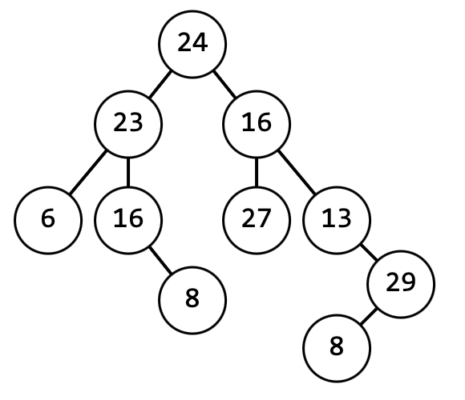
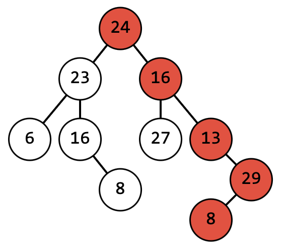

### Дано двоичное дерево. 

Требуется найти максимальную сумму значений узлов.

Пример

Максимальная сумма = 90

[Решение](Ex001/MaximumAmount.cs)

Реализовано на основе [Ex002_BinaryTree](../DotNet/Ex002_BinaryTree/)